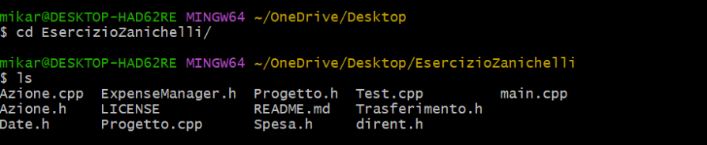
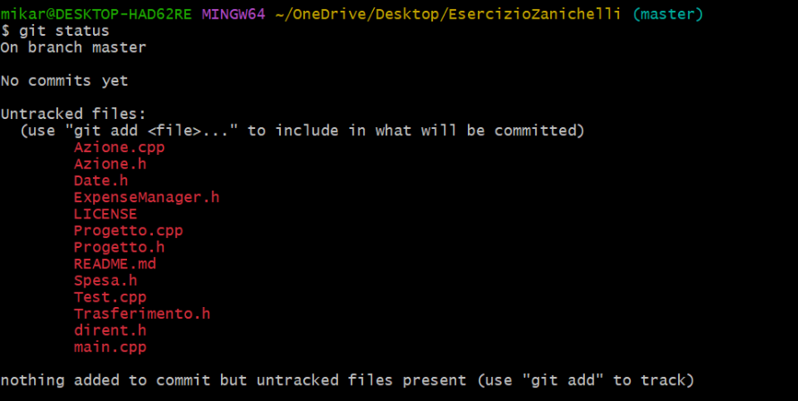
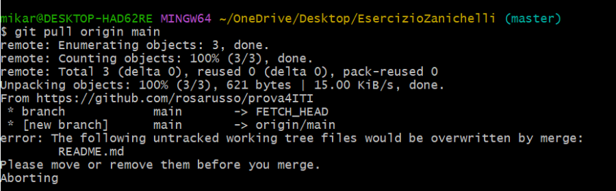

# Esercitazione per classe 4 ITI dell'Istituto Salesiano Don Bosco di Verona
## Tecnologie e progettazione di sistemi informatici e di telecomunicazioni
### A4 - Gestione e documentazione del codice
### Gestione delle versioni del codice sorgente con Git

Caso pratico: esercizio 13 a pag. 140 del libro di Tecnologie e progettazione di sistemi informatici e di telecomunicazioni 2 (Zanichelli), classe 4 ITI.

Dopo aver scaricato dal sito https://git-scm.com/downloads la versione del VCS Git per il sistema operativo utilizzato ed averla installata, creare un repository locale con una copia inizialmente uguale del codice sorgente del progetto software Expense-manager (disponibile al repository GitHub https://github.com/giorgio-meini/ZanichelliExpenseManager ).
Apportare modifiche migliorative al codice e, una volta ultimato l'aggiornamento, riversarlo in un proprio repository GitHub appositamente creato.

> git clone https://github.com/giorgio-meini/ZanichelliExpenseManager.git

Creazione cartella progetto:
> mkdir EsercizioZanichelli

Copia dei file nella nuova cartella:
> cp ZanichelliExpenseManager/* EsercizioZanichelli

> cd EsercizioZanichelli

**Creazione repository su GitHub dal sito.**

Inizializzazione del repository locale:
> git init

Usa il branch main (default di github)
> git checkout -b main

Aggiunta dell’indirizzo remoto nel repository locale (collega il repo locale al remoto):
> git remote add origin \<link-al-repository-personale\>

> git status

> git pull origin main

Come si vede nell'immagine, nel caso in cui il repository appena creato abbia già un README di default si presenta un conflitto. In questo caso, si potrebbe modificare il nome del vecchio file:
> mv README.md readme.old

> git pull origin main

> git status

Aggiunta contenuto cartella nello stage:
> git add .

Prova a fare un commit (sincronizza il contenuto locale con quello dello stage, integra le modifiche all’interno del repository)
> git commit -m "Add file del progetto ExpenseManager"

Se viene chiesta l'autenticazione:
> git config --global user.email "\<email-account-git\>"
e, se necessario, ripetere il commit.

Sincronizza il repository remoto con il contenuto del repository locale:
> git push origin main

**Per apportare modifiche al repository remoto**:
> git add \<nome-file-aggiornato-o-regex\>
> 
> git commit -m “\<Descrizione delle modifiche\>”
> 
> git push origin main
